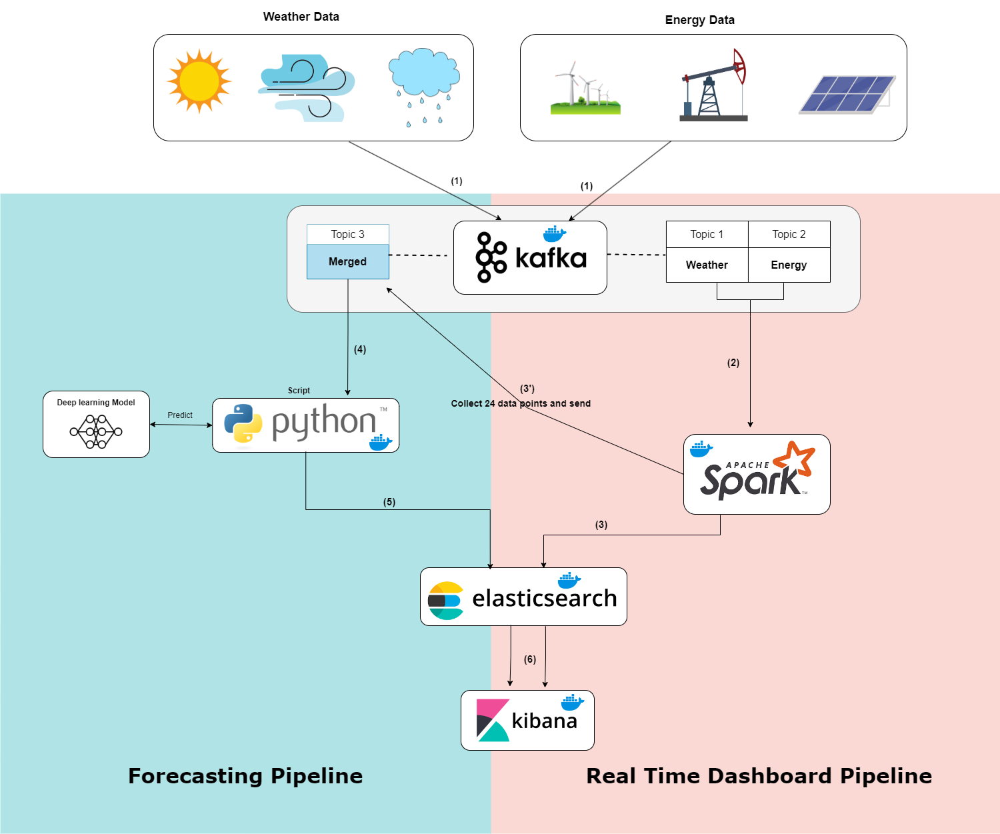
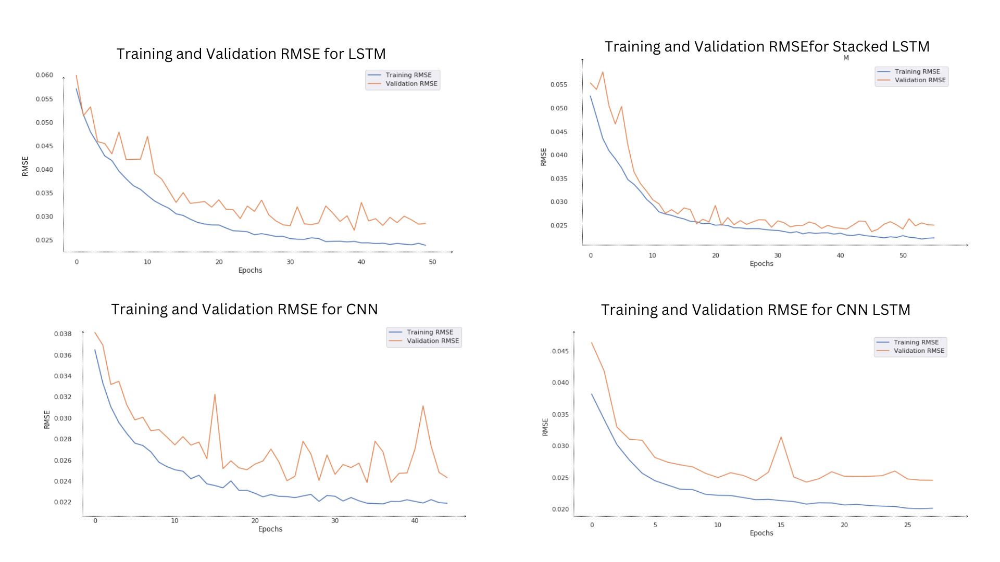
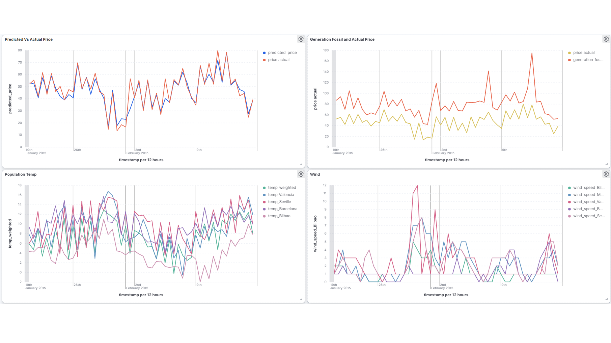

# Hourly Energy Price Forecasting Real-Time Dashboard

- [Overview](#overview)
- [System Architecture](#system-architecture)
- [Data Pipeline Overview](#data-pipeline-overview)
- [Hourly Price Forecasting Model](#hourly-price-forecasting-model)
- [Forecasting Evaluation](#forecasting-evaluation)
- [Setup and Running Instructions](#setup-and-running-instructions)
- [Kibana Dashboard Visualization Examples](#kibana-dashboard-visualization-examples)
- [Final Dashboard Example](#final-dashboard-example)
- [Conclusion](#conclusion)

## Overview

This project develops a real-time dashboard for hourly energy price forecasting, integrating data processing and predictive analytics to provide timely insights into energy market dynamics.

## System Architecture

The architecture utilizes Apache Kafka for data management and Apache Spark for predictive analytics. This bifurcated system is designed to handle and process energy and weather data efficiently, providing accurate forecasts through a real-time dashboard.

## Data Pipeline Overview



*Figure 1: Forecasting and Real-Time Dashboard Pipeline*

The proposed solution's architecture is crafted to fulfill two main goals: streamline the data preparation process and execute advanced predictive analytics. It consists of a data management pipeline that employs Kafka and Spark for data ingestion and preprocessing, and a predictive analytics pipeline that utilizes a deep learning model for future price prediction.

## Hourly Price Forecasting Model

In pursuit of the most effective model for predicting hourly energy prices, we benchmarked four different models: LSTM, Stacked LSTM, 1D CNN, and CNN-LSTM. Each model was selected based on its ability to process time series data and predict future prices efficiently:

- **LSTM Model**: Quick to train and computationally light, ideal for real-time applications.
- **Stacked LSTM Model**: Multiple layers capture complex patterns, yielding a nuanced understanding of data.
- **1D CNN Model**: Excels in identifying short-term patterns, making it adept at capturing immediate trends.
- **CNN-LSTM Model**: Combines CNN's local pattern recognition with LSTM's sequence modeling for enhanced predictive accuracy.

## Forecasting Evaluation

## Evaluation Plots


The figure in question presents four graphs, each representing the training and validation
RMSE for different neural network architectures: LSTM, Stacked LSTM, CNN, and CNN-
LSTM. Each model presented a unique response during training, with LSTM models
showing steady convergence and CNN models capturing local temporal features effectively.

## RMSE scores for different neural network model


            | Model           | LSTM  RMSE | Stacked LSTM |  1D CNN   |CNN + LSTM|
            |-----------------|------------|--------------|-----------|----------|
            | Validation RMSE |   0.0248   |   0.0227     |  0.021    |  0.0208  |
            | Test RMSE       |3.171       |   2.48       |  2.345    |   2.436  |


*Table 1: Performance evaluation of forecasting models*

The evaluation table showcases the performance of each model, with the Stacked LSTM model demonstrating a strong balance between training and generalization capabilities, making it our chosen model for real-time forecasting.
## Model Selection

The Stacked LSTM model stood out, exhibiting the most promising balance between fitting to the training data and generalizing to unseen data, as evidenced by its RMSE scores. Moreover, when considering the training duration, the Stacked LSTM model demonstrated remarkable efficiency, offering rapid predictions which are vital in real-time applications.


## Setup and Running Instructions

1. Start the Docker Containers:
    ```
    docker-compose up -d
    ```
2. Install Python dependencies:
    ```
    pip install -r requirements.txt
    ```
3. Run the Kafka Producer:
    ```
    python kafka_producer.py
    ```
4. Execute the Data Processing Scripts:
    - For Windows: `run.bat`
    - For Linux/MacOS: `run.sh`
5. Launch the Kafka Consumer for Predictions:
    ```
    python merged_data_kafka_consumer.py
    ```
6. Access Kibana Dashboard at `http://localhost:5601`.

## Kibana Dashboard Visualization Examples

- **Predicted Vs Actual Price**: Compares model predictions with actual prices.
- **Generation Fossil and Actual Price**: Shows the impact of fossil fuel generation on pricing.
- **Population Temperature**: Correlates regional temperatures with energy demand.

## Final Dashboard Example



*Figure 2: Final Kibana Dashboard Visualization*

The final Kibana dashboard provides a visual representation of the forecasting model's accuracy and insights into the energy market, showcasing the real-time effectiveness of our solution.

## Conclusion

The Hourly Energy Price Forecasting Dashboard encapsulates a cutting-edge approach to understanding energy market dynamics. By leveraging the latest advancements in data processing and machine learning, it empowers stakeholders to make data-driven decisions with speed and precision. As the energy sector continues to evolve, this tool will prove indispensable for navigating the complexities of market pricing and for supporting sustainable energy practices.
